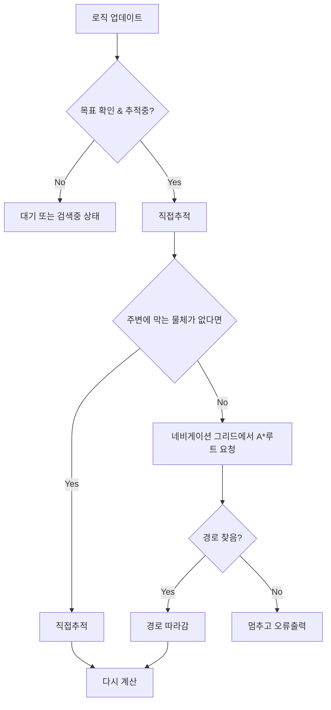

# AStar-Navigaion-And-Direct-Chase-Player-Track

목적: 유저를 trace하여 직접 추적하는 방식은 visibility가 막히면 멈추거나 벽에 충돌함.
A* 네비게이션만 사용하면 리소스를 많이 사용하며 효율이 떨어짐

구현: 프리셋을 사용하지 않은 A* 네비게이션 루팅 시스템. 
  - Collision과 floor데이터를 받아 그리드 생성
  - 직접 추적과 A* 웨이포인트를 상황에 따라 유기적으로 변경
  - 막힌 Grid에서 시작하는 경우 자동 복구

## 시스템 플로우차트

## 직접 추적
  1. 움직이는 플레이어의 캡슐 크기를 읽음
  2. 개체로부터 플레이어까지 Sweep하여 목표위치 확인
  3. 땅이 없거나 갈 수 없는곳이 있다면 A* 사용

 ## 그리드 기반 A* 네비게이션 추적

`UZombiePathfindingComponent::BuildGrid`가 처음 시작할 때 Grid를 생성함

  - 사용자가 지정한 크기의 셀 크기로 생성, 작을수록 더 깔끔하게 피해감
  - 개체가 목적지에 들어갈 수 있을지 미리 테스트
  - 걸어갈 수 있는 곳은 평면배열에 노드로 저장
  - Pawn은 그리드 생성중에 무시

`FindPath`는 개체 위치 와 목표 위치를 Grid Cell로 Convert한 뒤 
  - 상하좌우 방향의 인접한 셀 탐색
  - 셀 한 칸을 이동할 때마다 10의 비용 사용
  - 맨해튼 거리를 휴리스틱으로 사용함
  - Open set, Closed Set, G-Cost array, Patten Array 사용
  - 역추적하여 경로를 복원한 뒤 뒤집어서 경로 완성

개체가 막힌 곳으로 판정된 곳에서 시작하는 경우 주변으로 탐색 범위를 넓혀 이동 가능한 가까운 셀을 찾고, 경로 요청을 실패 처리하는 대신 그 셀을 경유점으로 사용함.

대각선을 사용하지 않는 이유

| A: 개체 | 벽 |

| 벽 | B: 목적지 |

이러한 상황이 발생한다면 대각선 이동을 허용한다면 현재 경로 탐색기는 이동 가능함으로 보고 이동을 시도하지만 실제로 이동할 수 없음

## 디버깅
  게임 시작 후 그리드를 그릴 수 있음. 
| 색  | 설명 |
|---|---|
| 초록색 셀 | 이동할 수 있고 걸을 수 있는 땅이 있는 셀 |
| 빨간 셀 | 막혔거나, 또는 다른 이유들로 인해 갈 수 없는 셀 |
| Cyan색 트레이싱 라인 | A*가 리턴한 웨이포인트 Path |

## AI 활용 
  알고리즘을 설계 한 뒤 뼈대 작성 후 GPT 5.6 Sol을 사용하여 코드를 검증. 

## 샘플 사진
